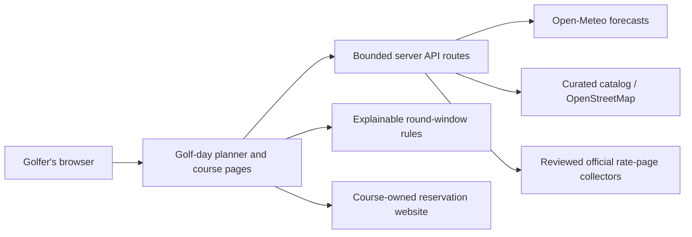

# FairwayOS

A golfer-first website: understand the golf day, compare nearby courses, plan a round, and book directly with the course.

## Run

Node 24 and pnpm 11 are recommended. Install with `pnpm install`, then `pnpm dev`. Run `pnpm typecheck`, `pnpm lint`, `pnpm test`, and `pnpm build` before deploying. The build emits a Cloudflare Worker and static assets.

The existing FairwayOS design exports inform the green/gold palette, Playfair Display and Inter typography, editorial layout, and supplied imagery. The landing-page backdrop remains illustrative design artwork; course photography has explicit source and license credits, with information-card fallbacks where photos are unavailable.

## Architecture

The browser stores only location preferences and saved courses. Server adapters return explicit sources, timestamps, and unknown states. The rule engine considers every forecast hour across a 4.5-hour or 2.5-hour round, rejects hazardous conditions, and ensures completion before sunset. Forecasts do not establish course-open status or tee-time availability.

The initial catalog contains six Front Range courses. Outside that area, Photon discovers nearby named golf courses and excludes explicitly private access when that metadata is available. Visitor access is otherwise unknown when that metadata is available. Visitor access is otherwise unknown. OSM listings may still need visitor-access verification. It is a best-effort discovery service, not a complete national catalog.

## Data operations

- Weather: 15-minute in-memory cache, three forecast days, course-specific coordinates on detail pages.
- Official rate tables: six-hour cache, fixed source allowlist, robots checks, bounded fetches, strict row extraction. Current adapters cover Legacy Ridge, Walnut Creek, and Broadlands. No login or access-control bypass is used.
- Catalog facts and notices: source-reviewed September 5, 2026. Notices have validity windows; snapshot prices disappear after 30 days and seasonal prices are date-bounded. Review facts and notices routinely.
- Reservation systems: direct official handoffs. CPS rejected public automated reads during integration. No exact inventory is claimed. Arrowhead's public booking shell requires a separate validated adapter before its inventory can be exposed.
- `Availability` and `TeeTime` contracts reserve explicit live, unknown, and unavailable states. A future adapter must validate local start, holes, player capacity, price scope, fetched timestamp, and booking URL. Empty results may mean sold out only after a successful complete inventory query.
- Caches are bounded and coalesce concurrent requests within each Worker isolate. They are not a distributed rate limiter or durable ingestion store. Before broad rollout, move collection to scheduled jobs and shared storage with per-provider quotas and metrics.
- Provider failures emit structured server logs and preserve useful course information. No raw IP or authentication values are logged. Fetch time and response sizes are bounded.

## Configuration and deployment

The free Open-Meteo endpoint is used for personal evaluation. For commercial operation, configure `OPEN_METEO_API_KEY` as a runtime secret; the adapter automatically selects the commercial endpoint. See [Open-Meteo pricing and licensing](https://open-meteo.com/en/pricing). Keep `.env` private; `.env.example` documents the supported setting. Geocoding uses the public evaluation endpoint and also needs a commercial-provider decision before commercial rollout.

IP location uses hosting-supplied Cloudflare geolocation; Denver is the fallback. No client-selected IP headers are trusted. Manual location and device geolocation are supported. Weather and discovery requests transmit coordinates to the respective data providers.

The Sites manifest retains the registered private site. Production source is built with Vinext/Vite and the Sites plugin for Cloudflare Workers. No account or database is required for this first slice. `GolferProfile` is the future seam for account-owned favorites, handedness, and round preferences; golf-bag and instruction features are intentionally deferred.

## Validation

Unit tests cover whole-round weather hazards, sunset and timezone handling, shorter rounds, source parsing, robots rules, stale/seasonal prices, unknown inventory, and request coalescing. HTTP smoke checks exercise discovery, weather, geocoding, course signals, and page routes. Browser interaction testing has not been performed in this build.

Lint covers owned application code. The unmodified bundled UI catalog and its mobile hook are excluded because their baseline conflicts with the starter's strict accessibility rules. React Compiler diagnostics are disabled because this application does not enable React Compiler; hooks, type safety, and application accessibility rules remain enabled. A narrow exception keeps the horizontal forecast region keyboard-scrollable.

Navigation uses native anchors for normal document and fragment navigation, including keyboard/modifier clicks, instead of depending on the beta router's client interception. The location picker uses the installed Dialog primitive for a portaled overlay, modal focus containment, Escape/outside dismissal, and focus restoration.

Weather falls back to [NWS](https://www.weather.gov/documentation/services-web-api) for U.S. locations if Open-Meteo fails. NWS point metadata is cached for 24 hours, complete forecasts for 15 minutes, and an Open-Meteo 429 opens a 10-minute per-instance cooldown. Both NWS hourly periods and gridded gusts are required. Incomplete safety inputs exclude an hour; no weather is fabricated. NWS daytime flags supply a conservative “Play until” cutoff at the start of the last daytime hour, not an astronomical sunset. Outside NWS coverage, a failed Open-Meteo request remains explicitly unavailable. Requests are bounded to 9 seconds each; the browser allows 35 seconds for sequential provider fallback. Provider failures are structured logs without credentials or coordinates.

Course photography uses explicit `CoursePhoto` metadata and static 480/960/1600/2400px WebP variants, selected through `srcset` and `sizes` on cards and detail heroes. Only include photography whose identity and reuse grant have been verified. Run `python scripts/prepare_course_photo.py INPUT COURSE-SLUG` with Pillow installed; it refuses small inputs and never upscales. Add alt text, credit, source page, license URL, and capture date to the course record. Rendering fails back to the course guide if an image cannot load. Source originals stay in ignored `.build-assets/`; no third-party hotlink dependency is required.

Current photo: Fossil Trace, James St. John, photographed 2007-11-01, CC BY 2.0. Source: https://commons.wikimedia.org/wiki/File:Fossil_Trace_Golf_Course_(Golden,_Colorado,_USA)_2.jpg . Derivatives are resized/re-encoded and display-cropped; no scene content is generated or altered. Legacy Ridge, Arrowhead, Walnut Creek, Indian Peaks, and Broadlands still need supplied/licensed photos; their detail pages link to official course/gallery sites. Existing small illustrative course PNG files are retained as unused supplied reference assets. The landing-page backdrop remains illustrative.
